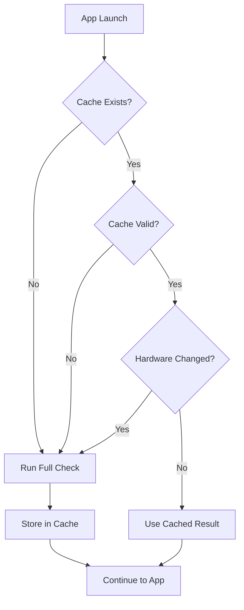
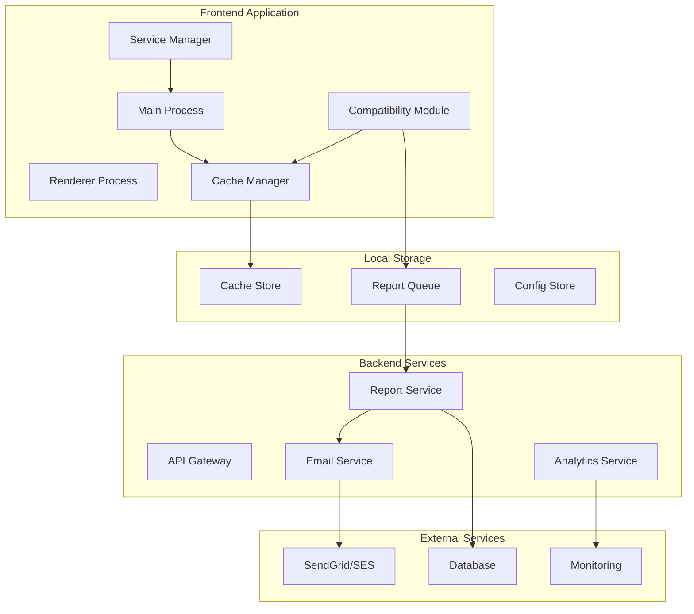
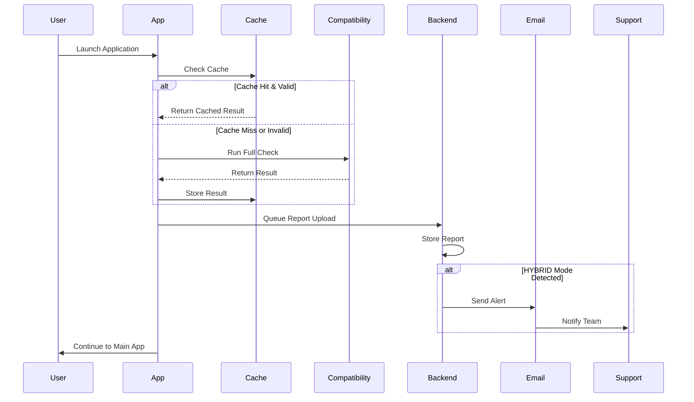

# Product Requirements Document - Phase 3
## CypherEdge Compatibility & Performance Enhancement

**Version:** 1.0.0  
**Date:** 2025-08-26  
**Status:** Planning  
**Owner:** Development Team  

---

## Executive Summary

Phase 3 focuses on optimizing the CypherEdge application's performance and user experience by addressing critical inefficiencies in the compatibility checking system, implementing intelligent caching, establishing backend integration for reports, and optimizing service management.

### Key Objectives
1. **Prevent Redundant Compatibility Checks** - Implement intelligent caching to avoid unnecessary re-checks
2. **Backend Integration** - Store and sync compatibility reports for support team access
3. **Email Reporting** - Automated report delivery to support/admin teams
4. **Performance Optimization** - Fix notification delays and optimize service startup
5. **Service Continuity** - Reuse services from compatibility phase in main application

---

## Current State Analysis

### Pain Points Identified

#### 1. Redundant Compatibility Checks
- **Issue**: System re-runs full compatibility check on every launch
- **Impact**: 45-60 second delay on each startup
- **User Experience**: Frustration with repetitive waiting periods

#### 2. Report Storage Fragmentation
- **Current Location**: `C:\Users\{user}\AppData\Roaming\Electron\compatibility-reports\`
- **Format**: JSON files with timestamps
- **Problem**: No centralized access for support team
- **Files Found**:
  ```
  compatibility-report-2025-01-01.json
  compatibility-summary-2025-01-01.json
  hardware-specs-2025-01-01.json
  ```

#### 3. Notification System Delays
- **Location**: `frontend/react-app/compatibility.html` (Line ~1465)
- **Issue**: Hardcoded 2-second delay in UNSCAN mode
- **Code**:
  ```javascript
  setTimeout(() => {
    window.electronAPI.sendProgressUpdate({
      phase: 'mode_notification',
      message: notificationMessage,
      percent: 85,
      mode: determinedMode
    });
  }, 2000);
  ```

#### 4. Service Lifecycle Inefficiency
- **Current Flow**:
  1. Start services for compatibility check
  2. Stop all services after check
  3. Restart services for main application
- **Impact**: Additional 10-15 seconds of startup time

---

## Proposed Solution Architecture

### 1. Intelligent Caching System

#### Cache Structure
```javascript
{
  "cacheVersion": "1.0.0",
  "systemFingerprint": "SHA256_HASH_OF_HARDWARE",
  "lastCheck": {
    "timestamp": "2025-01-15T10:30:00Z",
    "result": {
      "mode": "SCAN",
      "confidence": "high",
      "hardwareSpecs": {...},
      "scanTestResult": {...}
    },
    "ttl": 604800 // 7 days in seconds
  },
  "invalidationTriggers": [
    "hardware_change",
    "driver_update",
    "major_os_update"
  ]
}
```

#### Cache Validation Logic


#### Implementation Details
- **Storage Location**: `%APPDATA%/CypherEdge/compatibility-cache/`
- **Cache Key**: SHA256 hash of (CPU_ID + RAM_SIZE + GPU_ID + OS_VERSION)
- **TTL**: 7 days for stable systems, 24 hours for HYBRID mode
- **Invalidation Events**:
  - Hardware change detection
  - Driver updates
  - OS major updates
  - Manual user request

### 2. Report Management System

#### Backend API Endpoints
```yaml
POST /api/v1/compatibility/reports
  body:
    - userId: string
    - sessionId: string
    - report: CompatibilityReport
    - timestamp: ISO8601
    
GET /api/v1/compatibility/reports/{userId}
  response:
    - reports: CompatibilityReport[]
    - count: number
    
GET /api/v1/compatibility/stats
  response:
    - totalChecks: number
    - modeDistribution: {SCAN: %, UNSCAN: %, HYBRID: %}
    - averageCheckTime: seconds
    - failureRate: %
```

#### Local Storage Strategy
```javascript
class ReportManager {
  constructor() {
    this.localPath = path.join(app.getPath('userData'), 'reports');
    this.pendingSync = new Queue();
    this.syncInterval = 300000; // 5 minutes
  }
  
  async storeReport(report) {
    // Store locally first
    await this.saveLocal(report);
    
    // Queue for backend sync
    this.pendingSync.enqueue(report);
    
    // Attempt immediate sync
    this.syncWithBackend();
  }
  
  async syncWithBackend() {
    while (!this.pendingSync.isEmpty()) {
      const report = this.pendingSync.dequeue();
      try {
        await this.uploadReport(report);
        await this.markSynced(report.id);
      } catch (error) {
        this.pendingSync.enqueue(report); // Re-queue on failure
        break;
      }
    }
  }
}
```

### 3. Email Reporting System

#### Email Templates
```html
<!-- HYBRID Mode Alert Template -->
<!DOCTYPE html>
<html>
<head>
  <title>CypherEdge - Hybrid Mode Required</title>
</head>
<body>
  <h2>User Requires Hybrid Mode Setup</h2>
  <table>
    <tr><td>User ID:</td><td>{{userId}}</td></tr>
    <tr><td>System:</td><td>{{systemSpecs}}</td></tr>
    <tr><td>RAM:</td><td>{{ram}}GB</td></tr>
    <tr><td>CPU:</td><td>{{cpu}}</td></tr>
    <tr><td>Reason:</td><td>{{reason}}</td></tr>
  </table>
  <p>Action Required: Contact user for hybrid mode setup and payment processing.</p>
</body>
</html>
```

#### Email Service Integration
```javascript
class EmailService {
  constructor() {
    this.provider = 'SendGrid'; // or AWS SES
    this.templates = {
      hybridAlert: 'tmpl_hybrid_alert',
      weeklyReport: 'tmpl_weekly_report',
      errorAlert: 'tmpl_error_alert'
    };
  }
  
  async sendHybridAlert(userData) {
    const payload = {
      to: process.env.SUPPORT_EMAIL,
      cc: process.env.ADMIN_EMAIL,
      template_id: this.templates.hybridAlert,
      dynamic_template_data: userData
    };
    
    return await this.send(payload);
  }
}
```

### 4. Notification Optimization

#### Remove Artificial Delays
```javascript
// BEFORE (with delay)
setTimeout(() => {
  window.electronAPI.sendProgressUpdate({
    phase: 'mode_notification',
    message: notificationMessage,
    percent: 85,
    mode: determinedMode
  });
}, 2000);

// AFTER (immediate)
window.electronAPI.sendProgressUpdate({
  phase: 'mode_notification',
  message: notificationMessage,
  percent: 85,
  mode: determinedMode
});

// Add natural transition if needed
await this.transitionToNextPhase();
```

### 5. Service Reuse Architecture

#### Service Lifecycle Manager
```javascript
class ServiceLifecycleManager {
  constructor() {
    this.activeServices = new Map();
    this.serviceStates = {
      STOPPED: 0,
      STARTING: 1,
      RUNNING: 2,
      STOPPING: 3
    };
  }
  
  async startService(serviceName, config) {
    if (this.isRunning(serviceName)) {
      console.log(`Service ${serviceName} already running, reusing...`);
      return this.activeServices.get(serviceName);
    }
    
    const service = await this.initializeService(serviceName, config);
    this.activeServices.set(serviceName, service);
    return service;
  }
  
  async transitionServices(fromPhase, toPhase) {
    const requiredServices = this.getRequiredServices(toPhase);
    const currentServices = this.getActiveServices();
    
    // Keep common services running
    const toKeep = currentServices.filter(s => requiredServices.includes(s));
    const toStop = currentServices.filter(s => !requiredServices.includes(s));
    const toStart = requiredServices.filter(s => !currentServices.includes(s));
    
    // Stop unnecessary services
    await Promise.all(toStop.map(s => this.stopService(s)));
    
    // Start new services
    await Promise.all(toStart.map(s => this.startService(s)));
    
    console.log(`Transitioned from ${fromPhase} to ${toPhase}:
      - Kept: ${toKeep.length} services
      - Stopped: ${toStop.length} services
      - Started: ${toStart.length} services`);
  }
}
```

---

## Implementation Plan

### Phase 3.1: Caching System (Week 1)
- [ ] Design cache schema and validation logic
- [ ] Implement hardware fingerprinting
- [ ] Create cache storage and retrieval methods
- [ ] Add cache invalidation triggers
- [ ] Unit tests for cache system
- [ ] Integration with compatibility checker

### Phase 3.2: Backend Integration (Week 1-2)
- [ ] Design RESTful API endpoints
- [ ] Implement report upload queue
- [ ] Create offline-first sync mechanism
- [ ] Add retry logic with exponential backoff
- [ ] Backend database schema design
- [ ] API authentication and rate limiting

### Phase 3.3: Email System (Week 2)
- [ ] Set up email service provider (SendGrid/SES)
- [ ] Create email templates for each mode
- [ ] Implement alert triggers for HYBRID mode
- [ ] Add weekly summary reports
- [ ] Configure admin notification settings
- [ ] Test email delivery and formatting

### Phase 3.4: Performance Optimization (Week 2-3)
- [ ] Remove artificial delays in notifications
- [ ] Optimize IPC communication
- [ ] Implement progressive UI updates
- [ ] Add performance monitoring
- [ ] Profile and optimize bottlenecks
- [ ] A/B testing for user experience

### Phase 3.5: Service Management (Week 3)
- [ ] Create ServiceLifecycleManager
- [ ] Map service dependencies
- [ ] Implement service reuse logic
- [ ] Add health check monitoring
- [ ] Create graceful shutdown procedures
- [ ] Integration testing

---

## Success Metrics

### Performance KPIs
- **Startup Time Reduction**: 40% (from 60s to 36s average)
- **Compatibility Check Cache Hit Rate**: >85%
- **Service Restart Reduction**: 0 (complete reuse)
- **Notification Display Time**: <100ms (from 2000ms)

### Business KPIs
- **Support Ticket Reduction**: 30% (due to proactive HYBRID alerts)
- **User Satisfaction Score**: Increase by 15%
- **Backend Report Sync Rate**: 99.9%
- **Email Delivery Rate**: 99%

### Technical KPIs
- **Cache Storage Size**: <10MB per user
- **API Response Time**: <200ms (p95)
- **Memory Usage Reduction**: 20%
- **CPU Usage Optimization**: 15%

---

## Risk Assessment & Mitigation

### High Priority Risks

#### 1. Cache Corruption
- **Risk**: Invalid cache causes app malfunction
- **Mitigation**: 
  - Implement cache versioning
  - Add integrity checks (checksums)
  - Automatic cache rebuild on corruption
  - Fallback to full check

#### 2. Backend Sync Failure
- **Risk**: Reports lost due to network issues
- **Mitigation**:
  - Local queue with persistence
  - Exponential backoff retry
  - Bulk upload capability
  - Manual sync trigger

#### 3. Email Service Outage
- **Risk**: Critical alerts not delivered
- **Mitigation**:
  - Multiple provider fallback
  - Local alert logging
  - Admin dashboard notifications
  - SMS backup for critical alerts

### Medium Priority Risks

#### 1. Hardware Detection Changes
- **Risk**: OS updates change hardware detection
- **Mitigation**:
  - Multiple detection methods
  - Fallback strategies
  - Regular compatibility testing
  - Graceful degradation

#### 2. Service Reuse Conflicts
- **Risk**: Services in incompatible states
- **Mitigation**:
  - State validation before reuse
  - Service health checks
  - Automatic service restart
  - Isolation boundaries

---

## Technical Architecture

### System Components



### Data Flow



---

## API Specifications

### Compatibility Report Schema
```typescript
interface CompatibilityReport {
  id: string;
  userId: string;
  sessionId: string;
  timestamp: string; // ISO 8601
  version: string;
  
  system: {
    os: string;
    version: string;
    architecture: string;
    hostname: string;
  };
  
  hardware: {
    cpu: {
      model: string;
      cores: number;
      speed: number;
      class: 'i3' | 'i5' | 'i7' | 'i9' | 'other';
    };
    ram: {
      total: number; // GB
      available: number; // GB
    };
    gpu?: {
      vendor: string;
      model: string;
      vram: number; // MB
    };
  };
  
  decision: {
    mode: 'SCAN' | 'UNSCAN' | 'HYBRID';
    confidence: 'high' | 'medium' | 'low';
    reason: string;
    scanTest?: {
      passed: boolean;
      duration: number; // ms
      performance: string;
    };
  };
  
  metadata: {
    checkDuration: number; // ms
    cacheHit: boolean;
    errors: string[];
    warnings: string[];
  };
}
```

---

## Testing Strategy

### Unit Testing
- Cache validation logic
- Hardware fingerprinting
- Service lifecycle management
- Email template rendering
- Report queue management

### Integration Testing
- Cache with compatibility checker
- Backend sync with retry logic
- Service reuse during transitions
- End-to-end compatibility flow
- Email delivery verification

### Performance Testing
- Cache lookup speed
- Service startup time
- Memory usage under load
- Network sync efficiency
- UI responsiveness

### User Acceptance Testing
- Startup time perception
- Notification timing
- Error message clarity
- Cache effectiveness
- Support team workflow

---

## Timeline & Milestones

### Week 1 (Days 1-7)
- **Day 1-2**: Cache system design and implementation
- **Day 3-4**: Hardware fingerprinting and validation
- **Day 5-6**: Backend API design and initial implementation
- **Day 7**: Integration testing and bug fixes

### Week 2 (Days 8-14)
- **Day 8-9**: Complete backend integration
- **Day 10-11**: Email service setup and templates
- **Day 12-13**: Performance optimization (remove delays)
- **Day 14**: Testing and refinement

### Week 3 (Days 15-21)
- **Day 15-16**: Service lifecycle manager
- **Day 17-18**: Service reuse implementation
- **Day 19-20**: Full system integration testing
- **Day 21**: Final testing and deployment preparation

---

## Rollout Strategy

### Phase 1: Internal Testing
- Deploy to development environment
- QA team validation
- Performance benchmarking
- Bug fixing

### Phase 2: Beta Testing
- 10% of users (random selection)
- Monitor performance metrics
- Collect user feedback
- Iterate on issues

### Phase 3: Gradual Rollout
- 25% → 50% → 75% → 100%
- Monitor error rates
- Track support tickets
- Performance analysis

### Phase 4: Full Deployment
- All users on new system
- Deprecate old compatibility flow
- Monitor for 30 days
- Optimization based on data

---

## Appendices

### A. Current File Locations
```
Reports: C:\Users\{user}\AppData\Roaming\Electron\compatibility-reports\
Logs: C:\Users\{user}\AppData\Roaming\CypherEdge\logs\
Config: C:\Users\{user}\AppData\Roaming\CypherEdge\config\
Cache: C:\Users\{user}\AppData\Roaming\CypherEdge\cache\ (proposed)
```

### B. Environment Variables
```env
# Backend Configuration
API_BASE_URL=https://api.cypheredge.com/v1
API_KEY=<encrypted>

# Email Service
EMAIL_PROVIDER=sendgrid
SENDGRID_API_KEY=<encrypted>
SUPPORT_EMAIL=support@cypheredge.com
ADMIN_EMAIL=admin@cypheredge.com

# Cache Configuration
CACHE_TTL_DAYS=7
CACHE_MAX_SIZE_MB=10

# Feature Flags
ENABLE_CACHE=true
ENABLE_BACKEND_SYNC=true
ENABLE_EMAIL_ALERTS=true
ENABLE_SERVICE_REUSE=true
```

### C. Database Schema (Backend)
```sql
CREATE TABLE compatibility_reports (
  id UUID PRIMARY KEY,
  user_id VARCHAR(255) NOT NULL,
  session_id VARCHAR(255) NOT NULL,
  timestamp TIMESTAMP NOT NULL,
  mode VARCHAR(50) NOT NULL,
  confidence VARCHAR(50),
  hardware_specs JSONB,
  decision_data JSONB,
  metadata JSONB,
  created_at TIMESTAMP DEFAULT NOW(),
  updated_at TIMESTAMP DEFAULT NOW()
);

CREATE INDEX idx_user_id ON compatibility_reports(user_id);
CREATE INDEX idx_timestamp ON compatibility_reports(timestamp);
CREATE INDEX idx_mode ON compatibility_reports(mode);
```

---

## Approval & Sign-off

| Role | Name | Date | Signature |
|------|------|------|-----------|
| Product Owner | | | |
| Tech Lead | | | |
| QA Lead | | | |
| Support Lead | | | |

---

**Document Version History**

| Version | Date | Author | Changes |
|---------|------|--------|---------|
| 1.0.0 | 2025-08-26 | Development Team | Initial PRD creation |

---

*End of Document*