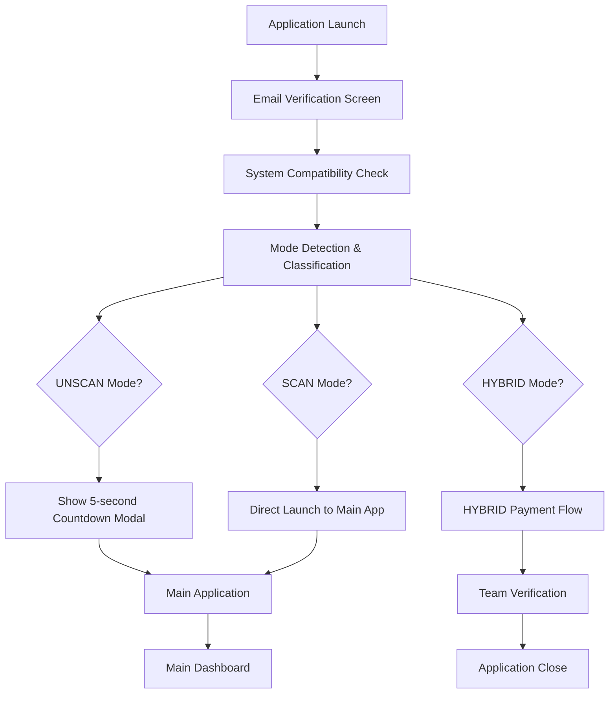

# CypherEdge System Compatibility Flow Documentation

## Overview
CypherEdge is a desktop application for Chartered Accountants (CA) that processes bank statements and financial documents. The application has a comprehensive system compatibility check and mode detection flow that determines the optimal operating mode based on hardware capabilities.

## Complete System Flow Architecture



## 1. Email Verification (Step 0)

### Location
- **Frontend**: `frontend/EmailVerification.js`
- **HTML**: `frontend/react-app/email-verification.html`

### Flow
```javascript
// EmailVerification.js:14-45
async runEmailVerification() {
  // Creates frameless window (500x400)
  await this.createEmailWindow();
  // Waits for email submission via IPC
  const result = await this.waitForEmailSubmission();
  // Currently always returns success
  return { success: true, canProceed: true, email: email };
}
```

### Key Features
- Frameless window with custom minimize/close buttons
- Email input validation
- IPC communication: `email:submit` handler
- Always passes validation (as per current implementation)

## 2. System Compatibility Check (Step 1)

### Main Components

#### 2.1 CompatibilityTests.js
**Location**: `frontend/compatibility/CompatibilityTests.js`

**Test Suites** (16 total tests):
1. **Port Availability** (3 tests)
   - Python Backend Port (7500)
   - Gateway Service Port (7890)
   - FastAPI Health Check

2. **System Requirements** (5 tests)
   - Memory Check
   - ML Models Memory
   - Disk Space
   - Windows Version
   - Admin Rights

3. **Component Tests** (4 tests)
   - Python Executable
   - Gateway Service
   - Database Access
   - File Permissions

4. **PDF Processing** (4 tests)
   - Component Startup Flow
   - FastAPI Dependencies
   - PDF Processing Capability
   - Server Management

#### 2.2 IsolatedCompatibilityBubble.js
**Location**: `frontend/compatibility/IsolatedCompatibilityBubble.js`

**Isolated Testing Process**:
```javascript
// IsolatedCompatibilityBubble.js:149-233
async runIsolatedCompatibilityTest() {
  // Phase 1: Kill existing processes
  await this.killAllExistingProcesses();
  
  // Phase 2: Start controlled instances
  const pythonResult = await this.startControlledPythonBackend();
  const gatewayResult = await this.startControlledGatewayService();
  
  // Phase 3: Test controlled services
  const pythonHealthResult = await this.testControlledPythonHealth();
  const gatewayHealthResult = await this.testControlledGatewayHealth();
  const pdfResult = await this.testControlledPDFProcessing();
  const licensingResult = await this.testControlledLicensing();
  
  // Phase 4: Generate results
  // Phase 5: Cleanup
  await this.cleanupControlledProcesses();
}
```

## 3. Mode Detection & Classification

### Mode Decision Engine
**Location**: `frontend/compatibility/modules/ModeDecisionEngine.js`

### Hardware Classification Logic

```javascript
// ModeDecisionEngine.js - Decision Matrix
const classifySystem = (specs) => {
  const { ram, cpu } = specs;
  
  // High-End: SCAN Mode
  if (ram >= 16 && compareCPU(cpu, 'i7') && scanTestPassed) {
    return 'SCAN';
  }
  
  // Mid-Range: UNSCAN Mode  
  if (ram >= 8 && compareCPU(cpu, 'i5') && !scanTestPassed) {
    return 'UNSCAN';
  }
  
  // Low-End: HYBRID Mode
  if (ram < 8 || !compareCPU(cpu, 'i5')) {
    return 'HYBRID';
  }
};
```

### Three Operating Modes

#### 3.1 SCAN Mode (High-End PC)
**Requirements**:
- RAM: 16GB or more
- CPU: Intel i7 or equivalent
- Scan Performance Test: PASS

**Flow**:
```
Hardware Detection → Meets Requirements → Direct Application Launch
```

**Implementation** (`compatibility.html:1756-1763`):
```javascript
case 'SCAN':
  console.log('✅ [SCAN FLOW] Direct launch - no modal needed');
  setTimeout(() => {
    this.triggerCompatibilityComplete(result);
  }, 3000);
  break;
```

#### 3.2 UNSCAN Mode (Mid-Range PC)
**Requirements**:
- RAM: 8GB or more
- CPU: Intel i5 or equivalent
- Scan Performance Test: FAIL

**Flow**:
```
Hardware Detection → Partial Requirements → Show Notification Modal → 5s Countdown → Auto Launch
```

**Implementation** (`compatibility.html:1820-1937`):
```javascript
showUnscanModeNotification(result) {
  // Creates centered modal with system info
  // 5-second countdown timer
  // "Launch Now" button for immediate launch
  // Auto-launch after countdown
}
```

#### 3.3 HYBRID Mode (Low-End PC)
**Requirements**:
- RAM: Less than 8GB
- CPU: Below Intel i5

**Flow**:
```
Hardware Detection → Below Requirements → Payment Flow → Team Verification → App Close
```

**HYBRID Payment Flow** (4 Steps):

1. **Decision Modal**:
   - Use Another Computer (Recommended)
   - Enable HYBRID Mode (₹2,499)

2. **Payment Information**:
   - QR Code Display
   - Reference: CYP-[timestamp]
   - Payment Instructions

3. **Team Verification**:
   - Payment Received Status
   - 2-4 hour verification timeline
   - Contact & Activation pending

4. **Application Close**:
   - HYBRID users cannot use Standard Mode
   - Must wait for team activation

## 4. Main Application Launch

### Launch Sequence
**Location**: `frontend/main.js`

```javascript
// main.js startup sequence
async function startupSequence() {
  // Step -1: Email Verification
  const emailResult = await emailVerification.runEmailVerification();
  
  // Step 0: System Compatibility Check
  const compatResult = await compatChecker.runFullCheck();
  
  // Step 1: Mode Detection
  const modeResult = await appModeManager.runModeDetection();
  
  // Step 2: Launch based on mode
  switch(modeResult.mode) {
    case 'SCAN': directLaunch();
    case 'UNSCAN': showModalThenLaunch();
    case 'HYBRID': showPaymentFlow();
  }
}
```

## 5. Backend Services

### Python FastAPI Backend
**Location**: `backend/main.py`
**Port**: 7500

**Key Endpoints**:
- `/health` - Health check
- `/add-pdf/` - PDF processing
- `/extract-entities/` - Entity extraction

### Gateway Service
**Location**: `frontend/gatewayServer/gatewayService.exe`
**Port**: 7890

**Features**:
- License validation
- PostgreSQL embedded database
- Authentication services

## 6. File Structure Map

```
CypherEdge/beta_testers_ca/
├── backend/
│   └── main.py                           # FastAPI backend (port 7500)
│
├── frontend/
│   ├── main.js                           # Main Electron process
│   ├── EmailVerification.js              # Email verification flow
│   ├── SystemCompatibilityChecker.js     # Compatibility orchestrator
│   │
│   ├── compatibility/
│   │   ├── CompatibilityTests.js         # Real system validation tests
│   │   ├── IsolatedCompatibilityBubble.js # Isolated testing environment
│   │   ├── AppModeManager.js             # Mode detection orchestrator
│   │   │
│   │   ├── modules/
│   │   │   ├── ModeDecisionEngine.js     # Hardware classification logic
│   │   │   ├── HardwareDetector.js       # System specs detection
│   │   │   └── ScanPerformanceTest.js    # Performance testing
│   │   │
│   │   ├── ui/
│   │   │   └── HybridModeFlow.js         # HYBRID payment flow UI
│   │   │
│   │   └── config/
│   │       └── appModeConfig.json        # Hardware thresholds config
│   │
│   ├── react-app/
│   │   ├── email-verification.html       # Email input UI
│   │   └── compatibility.html            # Compatibility check UI
│   │
│   └── gatewayServer/
│       └── gatewayService.exe            # .NET Gateway (port 7890)
│
└── dist/
    └── main/
        └── main.exe                       # PyInstaller Python executable
```

## 7. IPC Communication Flow

```
React UI ←→ Electron Main Process ←→ Backend Services

Email Flow:
email-verification.html → email:submit → EmailVerification.js

Compatibility Flow:
compatibility.html → compatibility:start-tests → CompatibilityTests.js
                  → test-progress → Live updates to UI
                  → compatibility:user-decision → Launch/Exit

Mode Detection Flow:
compatibility.html → app-mode:run-detection → AppModeManager.js
                  → mode-detection-progress → UI updates
                  → mode-detection-complete → Mode-specific flow
```

## 8. Mode-Specific User Journeys

### SCAN Mode Journey
```
1. Email Input → Pass
2. Compatibility Check → All Tests Pass
3. Hardware Detection → 16GB RAM, i7 CPU
4. Mode Assignment → SCAN
5. Direct Launch → Main Dashboard
```

### UNSCAN Mode Journey
```
1. Email Input → Pass
2. Compatibility Check → Most Tests Pass
3. Hardware Detection → 8GB RAM, i5 CPU
4. Mode Assignment → UNSCAN
5. Show Modal → "System will launch in 5 seconds"
6. Countdown → 5...4...3...2...1
7. Auto Launch → Main Dashboard (Limited Features)
```

### HYBRID Mode Journey
```
1. Email Input → Pass
2. Compatibility Check → Basic Tests Pass
3. Hardware Detection → 4GB RAM, i3 CPU
4. Mode Assignment → HYBRID
5. Decision Modal → User selects "Enable HYBRID"
6. Payment Screen → Shows QR Code
7. User Pays → Marks payment complete
8. Verification Screen → "Team will contact in 2-4 hours"
9. App Closes → Wait for team activation
```

## 9. Key Code Snippets

### Mode Detection Entry Point
```javascript
// frontend/compatibility/AppModeManager.js:39-100
async runModeDetection(options = {}) {
  // Load configuration
  const config = AppModeConfigManager.getConfig();
  
  // Check for test scenarios
  const hasTestScenario = options.scenario && 
    ['lowEnd', 'midRange', 'highEnd'].includes(options.scenario);
  
  // Run decision engine
  const decisionResult = await this.decisionEngine.determineAppMode(options);
  
  // Handle mode-specific flows
  return this.handleModeSpecificFlow(decisionResult);
}
```

### Hardware Detection
```javascript
// frontend/compatibility/modules/HardwareDetector.js
async getSystemSpecs() {
  const ram = os.totalmem() / (1024 * 1024 * 1024); // GB
  const cpuInfo = os.cpus()[0];
  const cpu = this.classifyCPU(cpuInfo.model);
  
  return {
    ram: { total: ram, class: this.classifyRAM(ram) },
    cpu: { model: cpuInfo.model, class: cpu }
  };
}
```

### HYBRID Payment Flow
```javascript
// frontend/react-app/compatibility.html:1940-2360
showHybridModeFlow(result) {
  // Step 1: Decision Modal
  // Step 2: Payment Info
  // Step 3: QR Code Display
  // Step 4: Team Verification
  // Step 5: App Close
}
```

## 10. Testing & Development

### Test Scenarios
**Configuration**: `frontend/compatibility/config/appModeConfig.json`

```json
{
  "testing": {
    "scenarios": {
      "lowEnd": {
        "hardwareProfile": { "ram": 4, "processor": "i3" },
        "expectedMode": "HYBRID"
      },
      "midRange": {
        "hardwareProfile": { "ram": 8, "processor": "i5" },
        "expectedMode": "UNSCAN"
      },
      "highEnd": {
        "hardwareProfile": { "ram": 16, "processor": "i7" },
        "expectedMode": "SCAN"
      }
    }
  }
}
```

### Development Commands
```bash
# Run in development mode
NODE_ENV=development npm run start

# Run in production mode
NODE_ENV=production npm run start

# Test specific scenario
# Use compatibility checker → Testing Panel → Select scenario
```

## Summary

The CypherEdge system compatibility flow is a sophisticated multi-step process that:

1. **Verifies user email** for basic authentication
2. **Runs comprehensive system tests** to ensure compatibility
3. **Detects hardware capabilities** and classifies into three modes
4. **Provides mode-specific user experiences**:
   - SCAN: Direct launch for high-end systems
   - UNSCAN: Notification with countdown for mid-range systems
   - HYBRID: Payment flow for low-end systems requiring cloud processing
5. **Launches the main application** with appropriate features enabled

This architecture ensures optimal performance across different hardware configurations while maintaining a professional user experience throughout the journey.