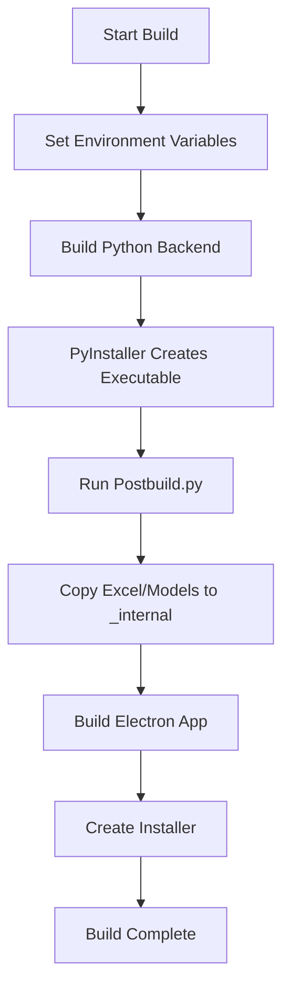

# Complete Build Process Guide

## Table of Contents
1. [Understanding the Build Chain](#understanding-the-build-chain)
2. [Setting Up Your Environment](#setting-up-your-environment)
3. [Automated Build Script](#automated-build-script)
4. [Build Configuration](#build-configuration)
5. [Troubleshooting Builds](#troubleshooting-builds)
6. [Optimizing Build Time](#optimizing-build-time)

## Understanding the Build Chain

### What Happens During Build



### Why Each Step Matters

1. **Environment Variables**: Tells the app it's in production mode
2. **Python Build**: Creates standalone executable with all dependencies
3. **Postbuild**: Ensures ML models and Excel templates are included
4. **Electron Build**: Packages everything into installer

## Setting Up Your Environment

### Prerequisites

1. **Python Environment**
   ```bash
   # Check Python version (need 3.8+)
   python --version

   # Install required packages
   pip install -r backend/requirements.txt
   pip install pyinstaller
   ```

2. **Node.js Environment**
   ```bash
   # Check Node version (need 14+)
   node --version
   npm --version

   # Install frontend dependencies
   cd frontend
   npm install
   cd ..
   ```

3. **Build Tools**
   - Windows: Visual Studio Build Tools
   - Admin privileges for some operations

### Directory Structure Required

```
ca-offline-suite/
├── backend/
│   ├── main.py
│   ├── requirements.txt
│   └── [other Python files]
├── frontend/
│   ├── package.json
│   ├── main.js
│   └── [other Electron files]
├── postbuild.py
└── build-automated.bat (we'll create this)
```

## Automated Build Script

### Complete Build Script

Create `build-complete.bat`:

```batch
@echo off
setlocal enabledelayedexpansion

REM ===== BUILD CONFIGURATION =====
set APP_NAME=CypherSol
set PYTHON_SCRIPT=backend/main.py
set PYTHON_EXE_NAME=ca-backend

REM ===== COLOR CODES =====
set RED=[91m
set GREEN=[92m
set YELLOW=[93m
set BLUE=[94m
set RESET=[0m

REM ===== HEADER =====
cls
echo %BLUE%===================================================%RESET%
echo %BLUE%        %APP_NAME% Automated Build System%RESET%
echo %BLUE%===================================================%RESET%
echo.

REM ===== TIMESTAMP =====
for /f "tokens=2 delims==" %%a in ('wmic OS Get localdatetime /value') do set "dt=%%a"
set "timestamp=%dt:~0,4%-%dt:~4,2%-%dt:~6,2%_%dt:~8,2%-%dt:~10,2%-%dt:~12,2%"
echo %YELLOW%Build started: %timestamp%%RESET%
echo.

REM ===== CREATE LOG FILE =====
set LOG_FILE=build_log_%timestamp%.txt
echo Build Log - %timestamp% > %LOG_FILE%
echo ======================== >> %LOG_FILE%

REM ===== PREREQUISITES CHECK =====
echo %BLUE%[1/8] Checking prerequisites...%RESET%

REM Check Python
python --version >nul 2>&1
if errorlevel 1 (
    echo %RED%ERROR: Python not found! Please install Python 3.8+%RESET%
    echo ERROR: Python not found >> %LOG_FILE%
    pause
    exit /b 1
)
echo %GREEN%✓ Python found%RESET%

REM Check Node.js
node --version >nul 2>&1
if errorlevel 1 (
    echo %RED%ERROR: Node.js not found! Please install Node.js 14+%RESET%
    echo ERROR: Node.js not found >> %LOG_FILE%
    pause
    exit /b 1
)
echo %GREEN%✓ Node.js found%RESET%

REM Check PyInstaller
pyinstaller --version >nul 2>&1
if errorlevel 1 (
    echo %YELLOW%PyInstaller not found. Installing...%RESET%
    pip install pyinstaller
)
echo %GREEN%✓ PyInstaller ready%RESET%

REM Check if main.py exists
if not exist %PYTHON_SCRIPT% (
    echo %RED%ERROR: %PYTHON_SCRIPT% not found!%RESET%
    echo ERROR: %PYTHON_SCRIPT% not found >> %LOG_FILE%
    pause
    exit /b 1
)
echo %GREEN%✓ Source files found%RESET%
echo.

REM ===== ENVIRONMENT SETUP =====
echo %BLUE%[2/8] Setting up environment...%RESET%
set NODE_ENV=production
set ELECTRON_IS_DEV=false
set GENERATE_SOURCEMAP=false

REM Create production .env file
echo NODE_ENV=production > frontend\.env.production
echo ELECTRON_IS_DEV=false >> frontend\.env.production
echo %GREEN%✓ Environment configured%RESET%
echo Environment configured >> %LOG_FILE%
echo.

REM ===== CLEAN PREVIOUS BUILD =====
echo %BLUE%[3/8] Cleaning previous builds...%RESET%
if exist dist (
    rmdir /s /q dist 2>nul
    echo %GREEN%✓ Cleaned dist directory%RESET%
)
if exist build (
    rmdir /s /q build 2>nul
    echo %GREEN%✓ Cleaned build directory%RESET%
)
if exist frontend\dist (
    rmdir /s /q frontend\dist 2>nul
    echo %GREEN%✓ Cleaned frontend/dist directory%RESET%
)
echo Clean completed >> %LOG_FILE%
echo.

REM ===== BUILD PYTHON BACKEND =====
echo %BLUE%[4/8] Building Python backend...%RESET%
echo This may take several minutes...

REM Create spec file for better control
echo Creating PyInstaller spec file...
(
echo # -*- mode: python ; coding: utf-8 -*-
echo.
echo block_cipher = None
echo.
echo a = Analysis(
echo     ['%PYTHON_SCRIPT%'],
echo     pathex=[],
echo     binaries=[],
echo     datas=[
echo         ^('backend/*.json', 'backend'^),
echo         ^('backend/models/*', 'backend/models'^),
echo     ],
echo     hiddenimports=[
echo         'pandas', 'numpy', 'sklearn', 'pytesseract',
echo         'pdf2image', 'PIL', 'cv2', 'openpyxl'
echo     ],
echo     hookspath=[],
echo     hooksconfig={},
echo     runtime_hooks=[],
echo     excludes=[],
echo     win_no_prefer_redirects=False,
echo     win_private_assemblies=False,
echo     cipher=block_cipher,
echo     noarchive=False,
echo ^)
echo.
echo pyz = PYZ^(a.pure, a.zipped_data, cipher=block_cipher^)
echo.
echo exe = EXE(
echo     pyz,
echo     a.scripts,
echo     a.binaries,
echo     a.zipfiles,
echo     a.datas,
echo     [],
echo     name='%PYTHON_EXE_NAME%',
echo     debug=False,
echo     bootloader_ignore_signals=False,
echo     strip=False,
echo     upx=True,
echo     upx_exclude=[],
echo     runtime_tmpdir=None,
echo     console=False,
echo     icon='frontend/assets/cyphersol-icon.ico'
echo ^)
) > build_spec.spec

REM Run PyInstaller with spec file
pyinstaller --clean --noconfirm build_spec.spec >> %LOG_FILE% 2>&1

if errorlevel 1 (
    echo %RED%ERROR: Python build failed! Check %LOG_FILE% for details%RESET%
    echo ERROR: Python build failed >> %LOG_FILE%
    pause
    exit /b 1
)

REM Verify executable was created
if not exist "dist\%PYTHON_EXE_NAME%.exe" (
    echo %RED%ERROR: Python executable not created!%RESET%
    echo ERROR: Python executable not created >> %LOG_FILE%
    pause
    exit /b 1
)

echo %GREEN%✓ Python backend built successfully%RESET%
echo Python build completed >> %LOG_FILE%
echo.

REM ===== RUN POSTBUILD =====
echo %BLUE%[5/8] Running postbuild process...%RESET%
python postbuild.py >> %LOG_FILE% 2>&1

if errorlevel 1 (
    echo %RED%ERROR: Postbuild failed! Check %LOG_FILE% for details%RESET%
    echo ERROR: Postbuild failed >> %LOG_FILE%
    pause
    exit /b 1
)
echo %GREEN%✓ Postbuild completed%RESET%
echo Postbuild completed >> %LOG_FILE%
echo.

REM ===== INSTALL NPM DEPENDENCIES =====
echo %BLUE%[6/8] Checking npm dependencies...%RESET%
cd frontend

REM Check if node_modules exists
if not exist node_modules (
    echo Installing npm dependencies...
    call npm install >> ..\%LOG_FILE% 2>&1
    if errorlevel 1 (
        echo %RED%ERROR: npm install failed!%RESET%
        cd ..
        pause
        exit /b 1
    )
)
echo %GREEN%✓ Dependencies ready%RESET%
cd ..
echo.

REM ===== BUILD ELECTRON APP =====
echo %BLUE%[7/8] Building Electron app...%RESET%
echo This may take several minutes...
cd frontend

REM Use production env file
copy .env.production .env >nul 2>&1

REM Run build
call npm run build >> ..\%LOG_FILE% 2>&1

if errorlevel 1 (
    echo %RED%ERROR: Electron build failed! Check %LOG_FILE% for details%RESET%
    echo ERROR: Electron build failed >> ..\%LOG_FILE%
    cd ..
    pause
    exit /b 1
)

cd ..
echo %GREEN%✓ Electron app built successfully%RESET%
echo Electron build completed >> %LOG_FILE%
echo.

REM ===== VERIFY BUILD =====
echo %BLUE%[8/8] Verifying build...%RESET%

REM Find the installer
for %%f in (frontend\dist\*.exe) do set INSTALLER_PATH=%%f

if not defined INSTALLER_PATH (
    echo %RED%ERROR: Installer not found!%RESET%
    echo ERROR: Installer not found >> %LOG_FILE%
    pause
    exit /b 1
)

REM Get file size
for %%f in ("%INSTALLER_PATH%") do set INSTALLER_SIZE=%%~zf
set /a INSTALLER_SIZE_MB=%INSTALLER_SIZE% / 1048576

echo %GREEN%✓ Build verified%RESET%
echo   Installer: %INSTALLER_PATH%
echo   Size: %INSTALLER_SIZE_MB% MB
echo.

REM ===== BUILD COMPLETE =====
echo %GREEN%===================================================%RESET%
echo %GREEN%        BUILD COMPLETED SUCCESSFULLY!%RESET%
echo %GREEN%===================================================%RESET%
echo.
echo Installer location: %INSTALLER_PATH%
echo Build log: %LOG_FILE%
echo.

REM ===== OPTIONAL: OPEN OUTPUT FOLDER =====
echo Would you like to open the output folder? (Y/N)
set /p OPEN_FOLDER=
if /i "%OPEN_FOLDER%"=="Y" (
    explorer "frontend\dist"
)

endlocal
pause
```

### Quick Build Script

For faster rebuilds during development, create `build-quick.bat`:

```batch
@echo off
echo Quick Build - Skipping clean
echo ============================

set NODE_ENV=production
set ELECTRON_IS_DEV=false

REM Only rebuild what changed
echo Building Python backend...
pyinstaller --onefile --windowed --name ca-backend backend/main.py

echo Running postbuild...
python postbuild.py

echo Building Electron app...
cd frontend
call npm run build
cd ..

echo Build complete!
pause
```

## Build Configuration

### PyInstaller Configuration

Create `backend/pyinstaller.yaml`:

```yaml
# PyInstaller configuration
name: ca-backend
onefile: true
windowed: true
icon: ../frontend/assets/cyphersol-icon.ico

# Hidden imports for ML libraries
hiddenimports:
  - pandas
  - numpy
  - sklearn
  - sklearn.ensemble
  - sklearn.preprocessing
  - pytesseract
  - pdf2image
  - PIL
  - cv2
  - openpyxl
  - dateutil

# Data files to include
datas:
  - from: models/
    to: models/
  - from: *.json
    to: .

# Exclude unnecessary modules
excludes:
  - matplotlib
  - pytest
  - IPython
```

### Electron Builder Configuration

In `frontend/package.json`:

```json
{
  "build": {
    "appId": "com.cyphersol.ca-offline",
    "productName": "CypherSol",
    "directories": {
      "output": "dist"
    },
    "files": [
      "**/*",
      "!**/*.ts",
      "!**/*.map",
      "!src/",
      "!public/",
      "!.env.development"
    ],
    "extraResources": [
      {
        "from": "../dist/ca-backend.exe",
        "to": "backend/ca-backend.exe"
      },
      {
        "from": "../dist/_internal",
        "to": "backend/_internal"
      }
    ],
    "win": {
      "target": "nsis",
      "icon": "assets/cyphersol-icon.ico"
    },
    "nsis": {
      "oneClick": false,
      "allowToChangeInstallationDirectory": true,
      "createDesktopShortcut": true,
      "createStartMenuShortcut": true
    }
  }
}
```

## Troubleshooting Builds

### Common Issues and Solutions

#### 1. PyInstaller Import Errors
```
ModuleNotFoundError: No module named 'xxx'
```
**Solution**: Add to hiddenimports in spec file

#### 2. Large Executable Size
**Solution**: Use UPX compression and exclude unnecessary modules:
```batch
pyinstaller --upx-dir=C:\upx --upx-compress-icons=0
```

#### 3. Antivirus False Positives
**Solution**: 
- Sign your executable
- Submit to antivirus vendors
- Use `--windowed` flag to reduce suspicion

#### 4. Missing Data Files
**Solution**: Check postbuild.py is copying all required files:
```python
# In postbuild.py
files_to_copy = [
    ('backend/models', 'dist/_internal/models'),
    ('backend/data', 'dist/_internal/data'),
    ('media/vouchers', 'dist/_internal/vouchers')
]
```

#### 5. Environment Variable Issues
**Solution**: Always set them before building:
```batch
set NODE_ENV=production
set ELECTRON_IS_DEV=false
```

### Build Debugging

Enable verbose logging:

```batch
REM For PyInstaller
pyinstaller --debug=all --log-level=DEBUG

REM For npm
npm run build --verbose

REM For Electron Builder
set DEBUG=electron-builder
```

## Optimizing Build Time

### 1. Use Build Cache

```batch
REM Don't clean if not necessary
if "%1"=="--clean" (
    rmdir /s /q dist
    rmdir /s /q build
)
```

### 2. Parallel Building

```batch
REM Build Python and install npm deps in parallel
start /b pyinstaller backend/main.py
start /b cd frontend && npm install
```

### 3. Incremental Builds

Only rebuild what changed:
```python
# In postbuild.py
import filecmp

def should_copy(src, dst):
    if not os.path.exists(dst):
        return True
    return not filecmp.cmp(src, dst)
```

### 4. Use Faster Tools

- Replace `npm` with `pnpm` or `yarn`
- Use `Nuitka` instead of PyInstaller for Python

## Build Pipeline Best Practices

### 1. Version Management

Add version info to builds:
```batch
REM Read version from package.json
for /f "tokens=2 delims=:" %%a in ('findstr "version" frontend\package.json') do (
    set VERSION=%%a
    set VERSION=!VERSION:"=!
    set VERSION=!VERSION:,=!
    set VERSION=!VERSION: =!
)

echo Building version: %VERSION%
```

### 2. Build Artifacts

Save important files:
```batch
REM Create artifacts folder
mkdir "artifacts\%VERSION%"

REM Copy installer and logs
copy "frontend\dist\*.exe" "artifacts\%VERSION%\"
copy "%LOG_FILE%" "artifacts\%VERSION%\"
```

### 3. Build Notifications

Add notifications:
```batch
REM Success notification
powershell -Command "[System.Reflection.Assembly]::LoadWithPartialName('System.Windows.Forms'); [System.Windows.Forms.MessageBox]::Show('Build completed successfully!', 'CypherSol Build')"
```

## Next Steps

1. Run `build-complete.bat` for your first automated build
2. Use `build-quick.bat` for subsequent builds
3. Move to `04-implementing-cicd.md` to automate with GitHub Actions
4. Check `05-best-practices.md` for code quality standards